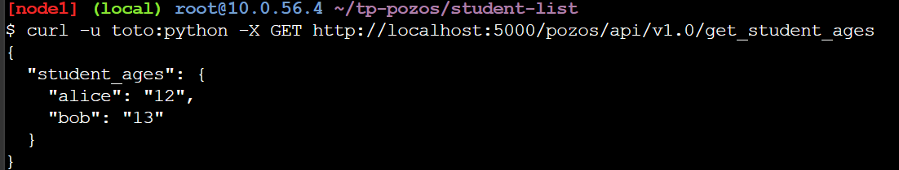
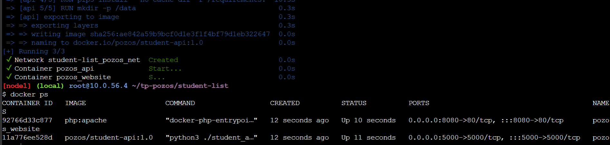
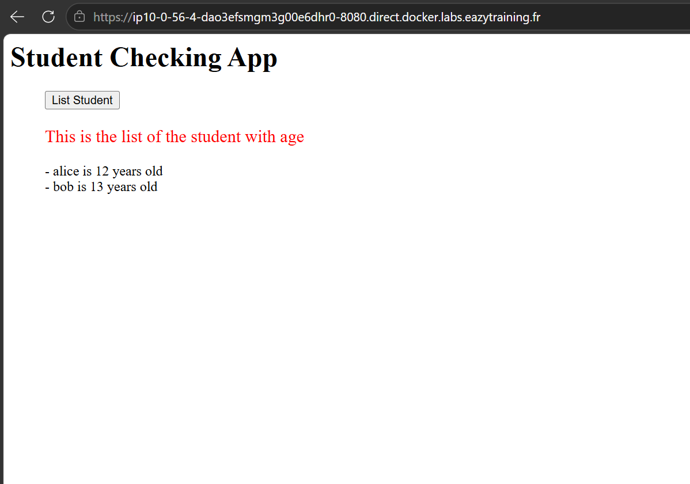
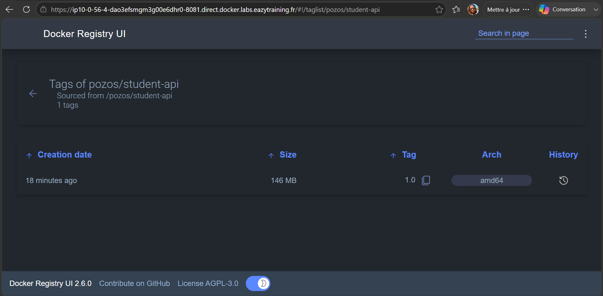
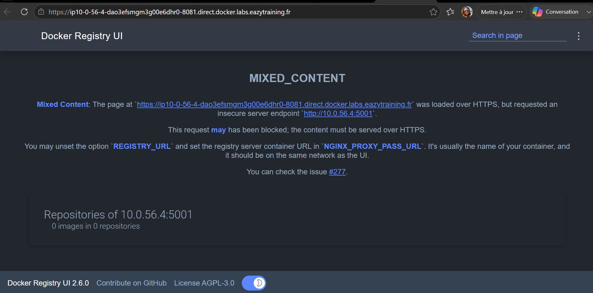

# POC Dockerisation - Application student_list (POZOS)

Auteur : Alvirra

## Contexte

POZOS, éditeur de logiciels pour lycées, souhaite disposer d'une infrastructure
Docker scalable et automatisée pour l'application `student_list`, jusque-là
déployée manuellement sur un serveur unique (sans scalabilité ni haute
disponibilité). Ce dépôt contient le POC de conteneurisation de l'application.

## Architecture

- api : conteneur construit à partir de l'image `python:3.13-slim`,
  exposant l'API REST Flask `GET /pozos/api/v1.0/get_student_ages`
  (authentification basique `toto` / `python`), port 5000
- website : conteneur `php:apache` servant `index.php`, qui interroge
  l'API pour afficher la liste des élèves, port 8080
- registry : registre Docker privé (`registry:2`) + interface web
  (`joxit/docker-registry-ui`) pour visualiser les images poussées

## 1. Build et test de l'image API

Construction de l'image à partir du `Dockerfile` :

```bash
cd simple_api
docker build -t pozos/student-api:1.0 .
```

Test isolé du conteneur, en montant le fichier de données :

```bash
docker run -d --name test_api -p 5000:5000 \
  -v $(pwd)/student_age.json:/data/student_age.json \
  pozos/student-api:1.0

curl -u toto:python -X GET http://localhost:5000/pozos/api/v1.0/get_student_ages
```

**Résultat obtenu :



## 2. Déploiement avec docker-compose (Infrastructure as Code)

Le fichier `docker-compose.yml` déclare deux services (`api` et `website`)
sur un réseau dédié, avec `depends_on` pour garantir que l'API démarre avant
le site web.

Avant le déploiement, la ligne suivante a été mise à jour dans
`website/index.php` pour utiliser le nom du service Docker plutôt qu'une
adresse IP en dur :

```php
$url = 'http://api:5000/pozos/api/v1.0/get_student_ages';
```

Lancement de l'infrastructure complète :

```bash
docker compose up -d --build
docker ps
```

Conteneurs actifs après déploiement :



Accès au site (`http://<IP_VM>:8080`) puis clic sur List Student :

Résultat obtenu :



## 3. Registre Docker privé

Déploiement du registre et de son interface web sur un réseau dédié :

```bash
docker network create registry_net

docker run -d --network registry_net -p 5001:5000 \
  --name registry registry:2

docker run -d --network registry_net -p 8081:80 \
  -e NGINX_PROXY_PASS_URL=http://registry:5000 \
  --name registry-ui joxit/docker-registry-ui:latest
```

Envoi de l'image construite vers le registre :

```bash
docker tag pozos/student-api:1.0 localhost:5001/pozos/student-api:1.0
docker push localhost:5001/pozos/student-api:1.0
```

Résultat obtenu :



## 4. Écarts par rapport aux consignes de base (justifications)

Le sujet précisait de ne pas désactiver de mécanisme de sécurité sans
justification. Voici les ajustements techniques effectués :

- **Paquet `gcc` ajouté dans le `Dockerfile`** : `requirements.txt` installe
  `flask_simpleldap`, qui dépend de `python-ldap` (extension C). Les headers
  demandés par le sujet (`libsasl2-dev`, `libldap2-dev`, `libssl-dev`) ne
  suffisent pas à eux seuls : il faut un compilateur pour construire cette
  extension, d'où l'ajout de `gcc`.
- **`python-dev` remplacé par `python3-dev`** : le paquet historique
  `python-dev` (transitionnel Python 2) n'existe plus sur les dépôts Debian
  utilisés par `python:3.13-slim`. Son équivalent actuel, `python3-dev`, a
  été utilisé à la place.
- **`NGINX_PROXY_PASS_URL` utilisé à la place de `REGISTRY_URL`** pour
  l'interface du registre : l'environnement de lab expose la VM en HTTPS via
  un reverse proxy, ce qui provoquait une erreur de contenu mixte
  (navigateur bloquant un appel HTTP direct depuis une page HTTPS) :

  

  La variable `NGINX_PROXY_PASS_URL`, combinée à un réseau Docker dédié
  (`registry_net`), fait transiter l'appel entre les deux conteneurs par leur
  nom interne plutôt que depuis le navigateur, ce qui contourne le blocage
  sans désactiver aucun mécanisme de sécurité (résultat visible en section 3
  ci-dessus).
- Aucun pare-feu ni mécanisme de sécurité du système n'a été désactivé.

## Structure du dépôt

```
.
├── README.md
├── docker-compose.yml
├── screen/
│   ├── 01-test-api-curl.png
│   ├── 02-website-liste-eleves.png
│   ├── 02b-docker-compose-ps.png
│   ├── 03-registre-erreur-mixed-content.png
│   └── 03-registre-image.png
└── simple_api/
    └── Dockerfile
```
